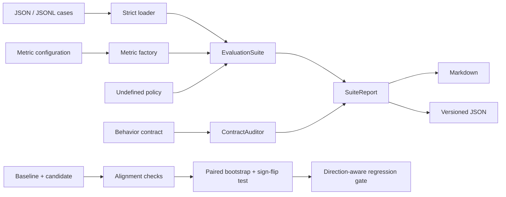

# MetricGuard

MetricGuard makes NLP metric behavior explicit, testable, and reviewable. It runs
evaluation cases under a declared policy for undefined values, then audits useful
properties such as boundedness, determinism, identity, and symmetry.

Metric code often looks small while carrying consequential decisions: whether two
empty answers are equal, whether malformed numbers score zero or disappear, which
normalization is applied, and whether an implementation can emit values outside its
documented range. MetricGuard records those decisions next to the cases that depend
on them.

[](https://github.com/appleweiping/metricguard/actions/workflows/ci.yml)
[](https://github.com/appleweiping/metricguard/actions/workflows/codeql.yml)
[](https://scorecard.dev/viewer/?uri=github.com/appleweiping/metricguard)
[](https://github.com/appleweiping/metricguard/releases)
[](https://www.python.org/)
[](LICENSE)

## What it does

- Evaluates JSON or JSONL cases with seven dependency-free text and numeric metrics.
- Keeps normalization policies explicit instead of hiding them in preprocessing code.
- Distinguishes an undefined result from a numeric zero.
- Resolves undefined values with one of four policies: `error`, `skip`, `zero`, or `one`.
- Audits metric contracts using observed and generated comparisons.
- Produces deterministic JSON for automation and Markdown for review.
- Compares aligned model runs with deterministic paired resampling and CI gates.
- Loads third-party metric entry points only after an explicit opt-in.
- Uses only the Python standard library at runtime.

MetricGuard is an evaluation reliability tool. It is not a leaderboard service, a
model runner, or a claim that every metric should be symmetric.

## Architecture



The raw metric returns `MetricValue(score=None, reason=...)` when a comparison is
not mathematically defined. Only `EvaluationSuite` may turn that into a score, so a
change from “skip” to “zero” is visible in configuration and review.

## Install

Install the latest source from GitHub:

```bash
python -m pip install "git+https://github.com/appleweiping/metricguard.git"
```

For development:

```bash
git clone https://github.com/appleweiping/metricguard.git
cd metricguard
python -m pip install -e ".[dev]"
```

## Five-minute CLI demo

`examples/text_cases.jsonl` and `examples/numeric_cases.jsonl` contain deliberate
formatting and numeric edge cases:

```json
{"id":"capitalization","reference":"The answer is Paris.","prediction":"the answer is paris"}
{"id":"number","reference":"25%","prediction":"0.25"}
```

Run a text metric:

```bash
metricguard run examples/text_cases.jsonl \
  --metric-config examples/text_metric.json \
  --audit
```

Actual output shape:

```text
# MetricGuard report: `exact_match`

- Contract status: **PASS**
- Cases: 3 (3 scored, 0 skipped)
- Macro mean: 0.666667
```

Run numeric equivalence and write machine-readable output:

```bash
metricguard run examples/numeric_cases.jsonl \
  --metric-config examples/numeric_metric.json \
  --undefined error --audit --symmetric \
  --format json --output metric-report.json
```

Exit code `0` means the run and its requested contracts passed. Exit code `2`
means input/configuration failed or an audited contract produced an error.

Compare two aligned prediction files and fail CI when the observed mean regresses:

```bash
metricguard compare examples/baseline_cases.jsonl examples/candidate_cases.jsonl \
  --metric rouge_l --samples 2000 --confidence 0.95 \
  --minimum-delta 0 --format json --output comparison.json
```

For a stricter statistical gate, add `--minimum-lower-bound 0`; this requires
the complete confidence interval to exclude a regression. Baseline and candidate
IDs, references, and tag sets must agree. File and tag order may differ. All built-in
metrics are higher-is-better; pass `--direction lower` for a lower-is-better plugin.

## Python API

```python
from metricguard import (
    Contract,
    ContractAuditor,
    EvaluationCase,
    EvaluationSuite,
    TextNormalizer,
    UndefinedPolicy,
    build_metric,
)

cases = [
    EvaluationCase("same", "Café", "cafe\u0301"),
    EvaluationCase("different", "red blue", "red green"),
]

metric = build_metric(
    {
        "kind": "token_f1",
        "normalizer": {"unicode_form": "NFC", "lowercase": True},
    }
)
suite = EvaluationSuite(cases, undefined_policy=UndefinedPolicy.ERROR)
report = suite.run(metric, auditor=ContractAuditor(Contract(symmetric=True)))

assert report.passed_contracts
print(report.mean_score)
```

## Built-in metrics

| Kind | Result | Notable policy |
|---|---|---|
| `exact_match` | `0` or `1` | Uses only the configured text normalizer |
| `token_f1` | `[0, 1]` | Counts duplicate tokens; both empty is `1` |
| `character_f1` | `[0, 1]` | Character multiset overlap after normalization |
| `numeric_equivalence` | `0`, `1`, or undefined | Percent and comma parsing are opt-in |
| `rouge_l` | `[0, 1]` | Pairwise token LCS F-score; configurable beta |
| `sentence_bleu` | `[0, 1]` | Single-reference BLEU with explicit smoothing and effective order |
| `levenshtein_similarity` | `[0, 1]` | Normalized character edit similarity |

Numeric equivalence uses decimal arithmetic for parsing and tolerance decisions. A
non-numeric value is undefined rather than silently treated as a wrong number.
`rouge_l` and `sentence_bleu` deliberately document their local semantics; they do
not claim byte-for-byte equivalence with an external ROUGE, SacreBLEU, or corpus
BLEU package.

## Statistical comparison

`BootstrapConfig` uses a versioned deterministic resampling stream, so the same
scores, seed, sample count, and package version produce the same percentile
interval on supported Python versions. `paired_comparison` resamples per-case
candidate-minus-baseline deltas; it does not compare two unrelated aggregate means.
The reported p-value comes from a separate paired sign-flip randomization test,
not from treating the ordinary bootstrap distribution as a null distribution.
The configured sample count controls both procedures.

Skipped cases must be skipped on both sides. A one-sided skip is an error because
it silently changes the evaluated population. Tag summaries are available through
`summarize_by_tag`. See [statistical comparison](docs/statistical-comparison.md).

## Metric plugins

Plugins register a factory under the `metricguard.metrics` entry-point group.
Discovery is never performed by a normal `build_metric` call. Call
`build_metric(..., load_plugins=True)`, `MetricRegistry.load_plugins()`, or pass
`--load-plugins` on the CLI to explicitly import installed plugin code. See
[the plugin contract](docs/plugins.md).

Plugin imports execute trusted third-party Python in the current process; this is
opt-in discovery, not sandboxing. Comparison uses one metric instance and assumes
its evaluation is deterministic. Select the correct optimization direction before
using a plugin score as a regression gate.

## Contracts

A `Contract` can check:

- **boundedness** — every defined score stays inside a declared interval;
- **determinism** — repeated evaluation of the same pair has the same outcome;
- **identity** — self-comparisons have the declared score;
- **symmetry** — swapping reference and prediction leaves the score unchanged.

Symmetry is disabled by default because precision-like and directional metrics are
legitimately asymmetric. Contract tolerances are explicit and never borrowed from
the metric's own tolerance.

## Input format

Each case has a stable string ID, a reference, and a prediction. Optional tags and
metadata are preserved by the loader for callers that group reports externally.
Text metrics require string references and predictions and never silently turn
`null`, booleans, arrays, or objects into text. Numeric equivalence accepts finite
JSON numbers or explicitly parseable numeric strings.

```json
{
  "id": "case-17",
  "reference": "expected answer",
  "prediction": "model answer",
  "tags": ["regression", "empty-safe"],
  "metadata": {"dataset": "held-out-v2"}
}
```

Unknown fields, duplicate case IDs, duplicate JSON object keys, and non-finite
JSON numbers fail fast. See [the case format](docs/case-format.md) for the complete
contract.

## Design guarantees

1. Runtime behavior is deterministic for built-in metrics.
2. An undefined value is never converted without a named policy.
3. Suite and comparison JSON reports carry a schema version and stable key ordering.
4. Normalization is local to a metric configuration.
5. Contract auditing does not mutate cases or metric configuration.

`--symmetric` enables contract auditing automatically; it is never accepted and
then silently ignored.

## Limitations

- MetricGuard does not download datasets or call model APIs.
- Built-in tokenization is whitespace-based after explicit normalization.
- `repr` is used only to avoid duplicate generated identity checks; it is not a corpus fingerprint.
- Bootstrap intervals quantify sampling variation in a fixed case set; they do not
  correct dataset bias, label leakage, or metric validity.

## Development

```bash
ruff check .
ruff format --check .
mypy src
pytest
```

CI runs these checks on supported Python versions. A reproducible synthetic benchmark
is available in [`benchmarks/`](benchmarks/README.md). See
[CONTRIBUTING.md](CONTRIBUTING.md) for the review and release workflow.

## Roadmap

- Streaming aggregation for evaluation suites that exceed memory.
- Multiple-comparison corrections for large metric families.
- A versioned migration command when a report schema changes.

## License

MetricGuard is released under the [MIT License](LICENSE).
